# Movie App

A Flutter application that provides an interface for browsing and managing movie information. This app allows users to view movie details, search for movies, and manage bookmarks.

## Usage

Home Screen: Displays a list of movies with options to view details, mark as favorite, or search for specific movies.

Search Screen: Allows users to search for movies based on various criteria.

Bookmark Screen: Shows a list of bookmarked movies.

## Screen Shots

- Moive Screen
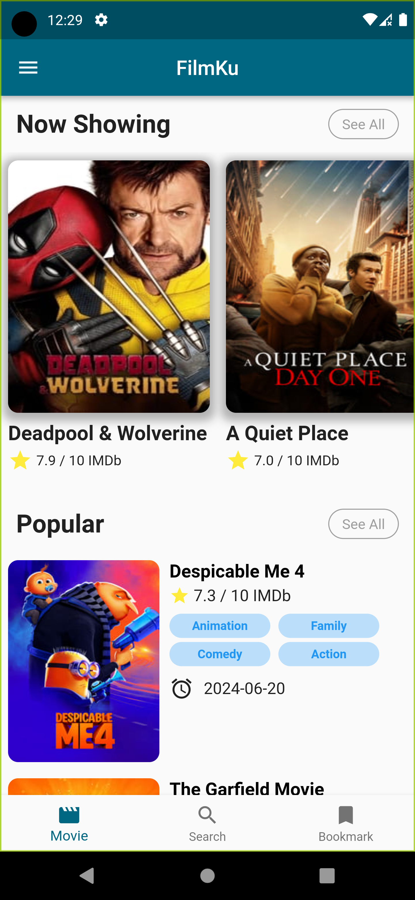

- Search Screen
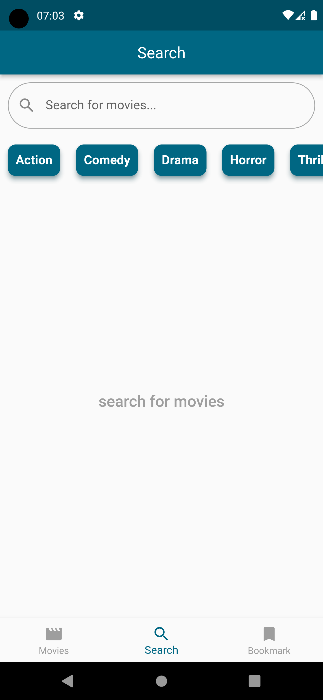 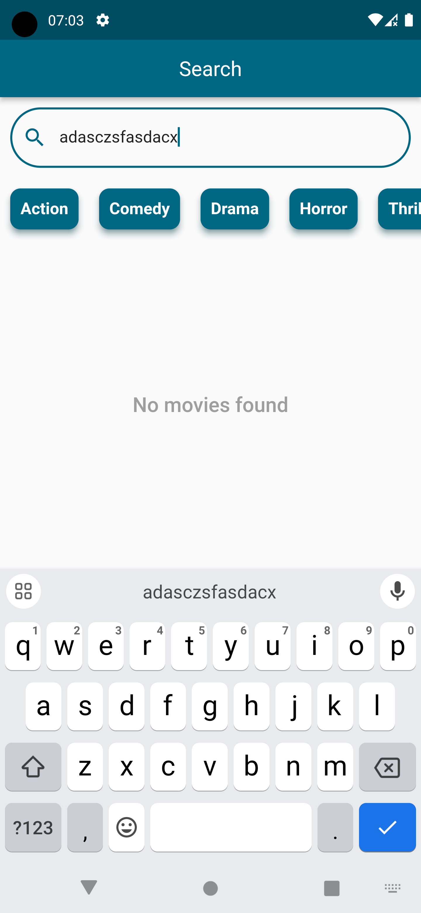 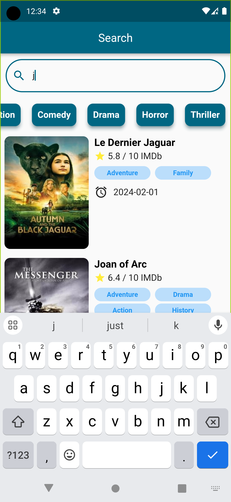

- BookMark Screen
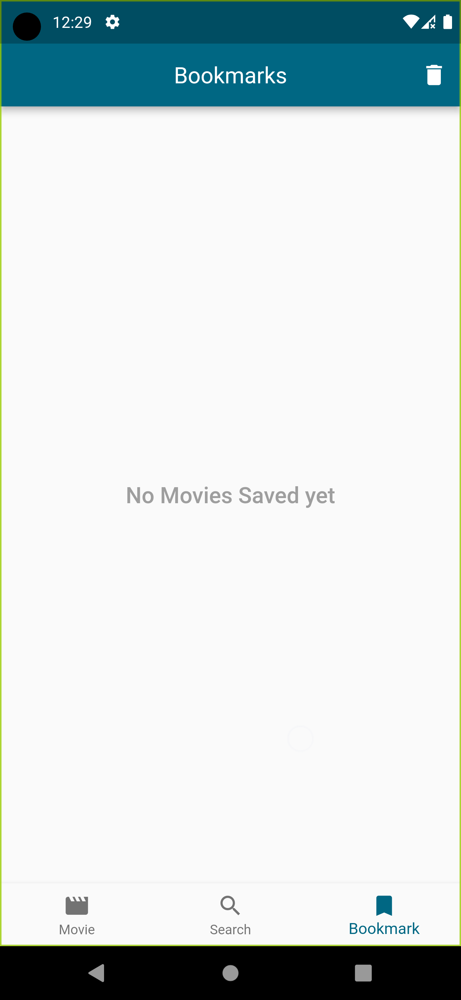 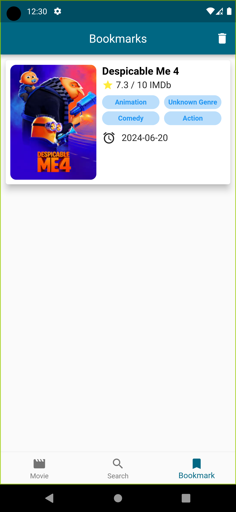 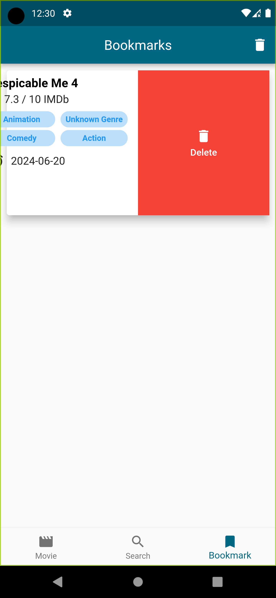

- Drawer
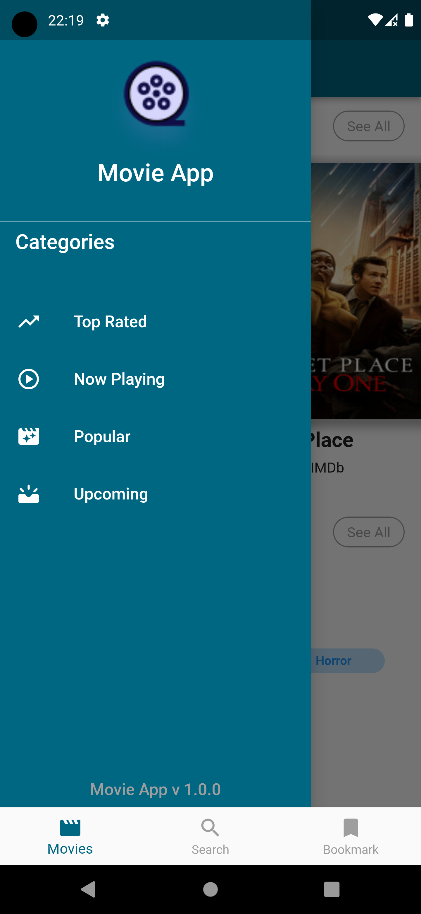

- Categories
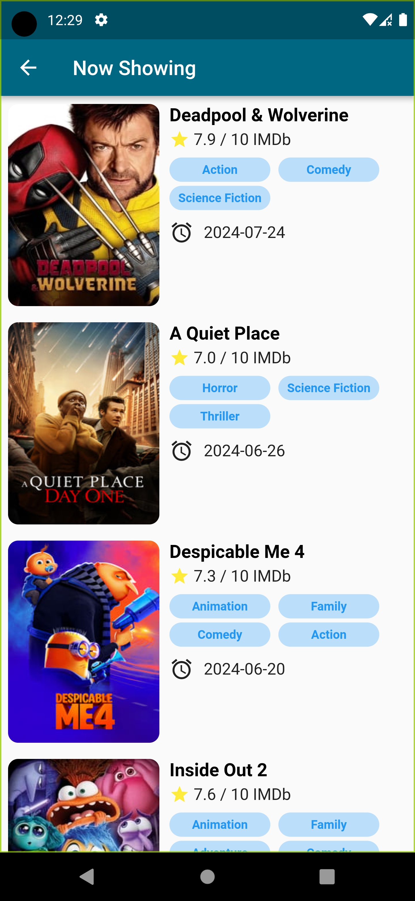 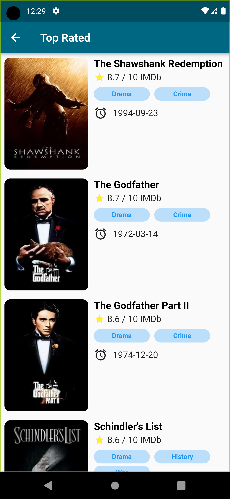  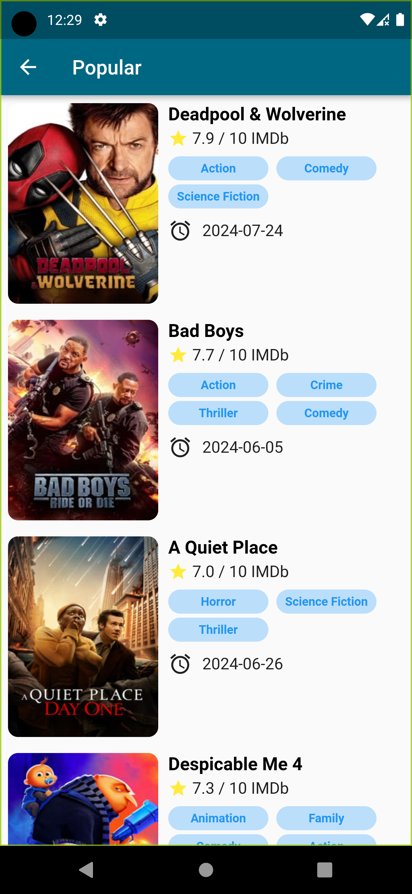 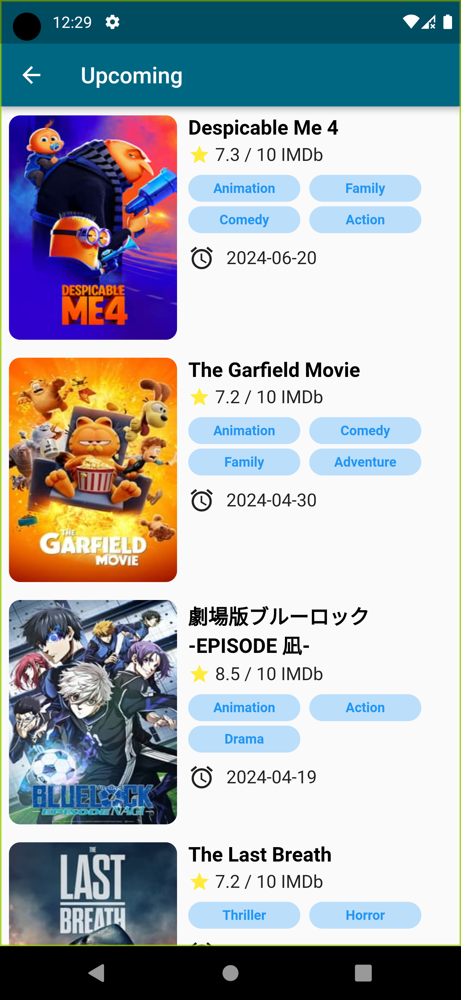

- Details Screen
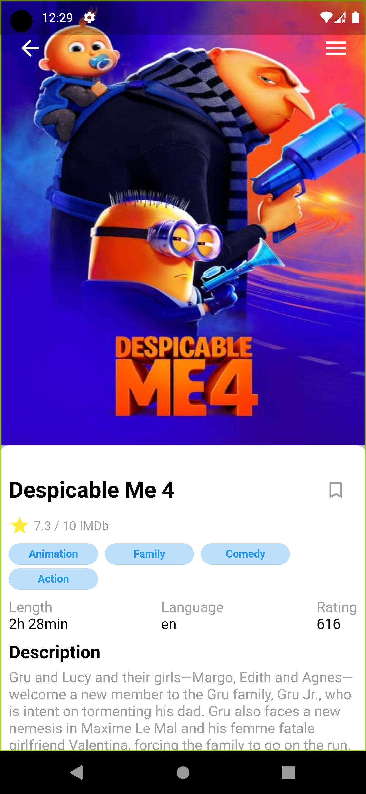 
